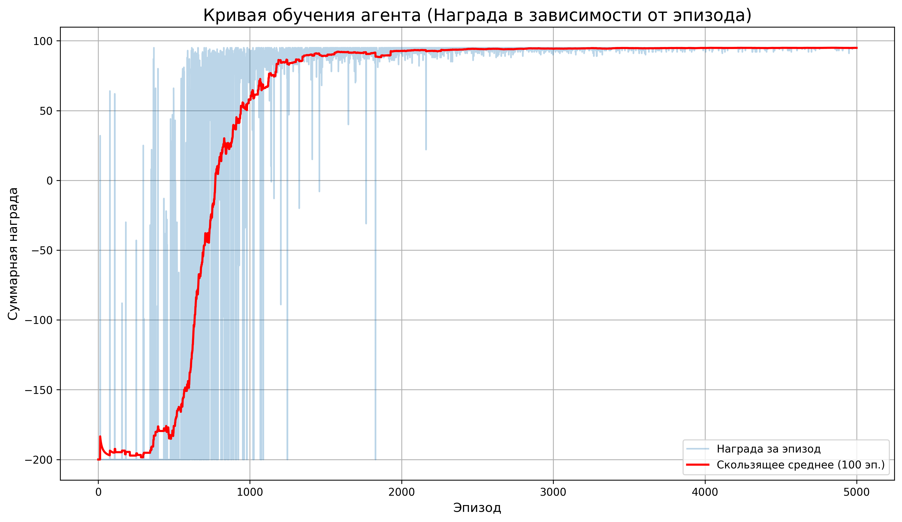

# Отчет по заданию №4: Обучение агента переливанию компота с помощью Q-обучения

## Описание задачи

Бабушка разлила по 5 стаканам компот, но сделала это неровно. Необходимо перелить компот так, чтобы во всех стаканах был одинаковый объем компота. Задача заключается в обучении агента переливать компот, минимизируя количество поднятий стаканов (можно поднять один стакан и разлить на несколько других - это одно поднятие).

## Постановка задачи

**Начальное состояние:** (10, 50, 20, 80, 40) мл компота в стаканах 1-5 соответственно.

**Целевое состояние:** (40, 40, 40, 40, 40) мл - равномерное распределение компота.

**Цель:** Научить агента находить оптимальную последовательность переливаний, минимизируя количество поднятий стаканов.

## Метод решения

Для решения задачи был использован алгоритм **Q-обучения (Q-Learning)** - один из методов обучения с подкреплением (Reinforcement Learning).

### Ключевая оптимизация

Для ускорения обучения и сокращения пространства состояний была введена **единица переливания** (`TRANSFER_UNIT = 10`). Поскольку все начальные объемы кратны 10, переливания происходят только порциями по 10 мл. Это значительно сокращает пространство состояний и позволяет агенту найти решение за считанные секунды.

### Архитектура решения

#### 1. Среда (Environment) - `CompoteEnv`

Класс, моделирующий среду с пятью стаканами компота:

- **Состояние (State):** кортеж из 5 чисел, представляющих объем компота в каждом стакане
- **Действие (Action):** кортеж `(from_glass, to_glass, amount)` - перелить `amount` мл из стакана `from_glass` в стакан `to_glass`
- **Награда (Reward):**
  - +100 при достижении целевого состояния
  - -1 за каждое действие (штраф за каждый шаг, мотивирующий поиск кратчайшего пути)
- **Завершение эпизода:** когда достигнуто целевое состояние

#### 2. Агент (Agent) - `QLearningAgent`

Агент, использующий Q-обучение:

- **Q-таблица:** словарь, хранящий Q-значения для пар (состояние, действие)
- **Стратегия выбора действия:** ε-жадная стратегия (ε-greedy)
  - С вероятностью ε выбирается случайное действие (исследование)
  - Иначе выбирается действие с максимальным Q-значением (эксплуатация)
- **Обновление Q-значений:** по формуле Беллмана:
  ```
  Q(s,a) = Q(s,a) + α * [r + γ * max Q(s',a') - Q(s,a)]
  ```
  где:
  - α (learning_rate) = 0.1 - скорость обучения
  - γ (discount_factor) = 0.95 - фактор дисконтирования
  - r - награда
  - s, a - текущее состояние и действие
  - s' - следующее состояние

### Гиперпараметры

- **LEARNING_RATE (α):** 0.1 - скорость обучения
- **DISCOUNT_FACTOR (γ):** 0.95 - фактор дисконтирования будущих наград
- **EPSILON:** 1.0 - начальная вероятность случайного действия
- **EPSILON_DECAY:** 0.999 - коэффициент уменьшения ε после каждого эпизода
- **MIN_EPSILON:** 0.01 - минимальная вероятность случайного действия
- **EPISODES:** 5000 - количество эпизодов обучения
- **TRANSFER_UNIT:** 10 - единица переливания (мл)

## Результаты обучения

### Кривая обучения



### Анализ кривой обучения

Кривая обучения демонстрирует три основных этапа:

1. **Начальный этап (первые ~500-1000 эпизодов):**
   - Кривая находится на очень низком уровне и хаотична
   - Это этап **исследования** (exploration)
   - `Epsilon` еще велик, поэтому агент часто совершает случайные действия
   - Агент редко достигает цели, получая много отрицательных наград

2. **Этап активного обучения (примерно с 1000 по 3000 эпизод):**
   - Скользящее среднее начинает уверенно расти
   - Агент накопил опыт в Q-таблице и начинает **эксплуатировать** (exploitation) свои знания
   - Агент чаще выбирает действия, ведущие к положительным результатам
   - Решение находится быстрее

3. **Плато (после 3000-4000 эпизодов):**
   - Кривая выходит на плато в области высоких значений
   - Агент **сошелся** к оптимальной или близкой к ней стратегии
   - `Epsilon` стал очень маленьким, агент почти всегда следует наилучшему известному пути
   - Средний результат стабильно высокий (около 95-96 наград)

### Пример решения обученного агента

После обучения агент находит следующее решение:

```
Начальное состояние: (10, 50, 20, 80, 40)
Действие: Перелить 10 из стакана 4 в стакан 1 -> Новое состояние: (20, 50, 20, 70, 40)
Действие: Перелить 10 из стакана 4 в стакан 3 -> Новое состояние: (20, 50, 30, 60, 40)
Действие: Перелить 10 из стакана 2 в стакан 1 -> Новое состояние: (30, 40, 30, 60, 40)
Действие: Перелить 10 из стакана 4 в стакан 1 -> Новое состояние: (40, 40, 30, 50, 40)
Действие: Перелить 10 из стакана 4 в стакан 3 -> Новое состояние: (40, 40, 40, 40, 40)

Цель достигнута!
```

**Количество поднятий стаканов:** 5 (каждое переливание - одно поднятие)

## Выводы

1. **Эффективность Q-обучения:** Алгоритм Q-обучения успешно справился с задачей обучения агента переливанию компота. Агент научился находить оптимальное решение за минимальное количество шагов.

2. **Важность оптимизации:** Введение единицы переливания (`TRANSFER_UNIT = 10`) кардинально сократило пространство состояний и ускорило обучение. Без этой оптимизации обучение могло бы занять значительно больше времени.

3. **Баланс exploration/exploitation:** ε-жадная стратегия с затуханием ε позволила агенту сначала исследовать среду, а затем эксплуатировать найденные оптимальные стратегии.

4. **Сходимость:** Кривая обучения демонстрирует четкую сходимость к оптимальной стратегии, что подтверждается выходом на плато в области высоких значений наград.

## Технические детали

### Используемые библиотеки

- `random` - для генерации случайных чисел
- `matplotlib.pyplot` - для построения графиков
- `collections.deque` - для эффективного хранения скользящего среднего

### Структура проекта

```
pr4_isit/
├── q-learning.ipynb      # Jupyter notebook с реализацией
├── README.md              # Данный отчет
└── img/
    └── learning_curve.png # График кривой обучения
```

## Заключение

Задача успешно решена с помощью алгоритма Q-обучения. Агент научился эффективно переливать компот между стаканами, достигая целевого состояния за минимальное количество шагов. Кривая обучения наглядно демонстрирует процесс обучения: от случайных блужданий к целенаправленному и оптимальному решению задачи.

